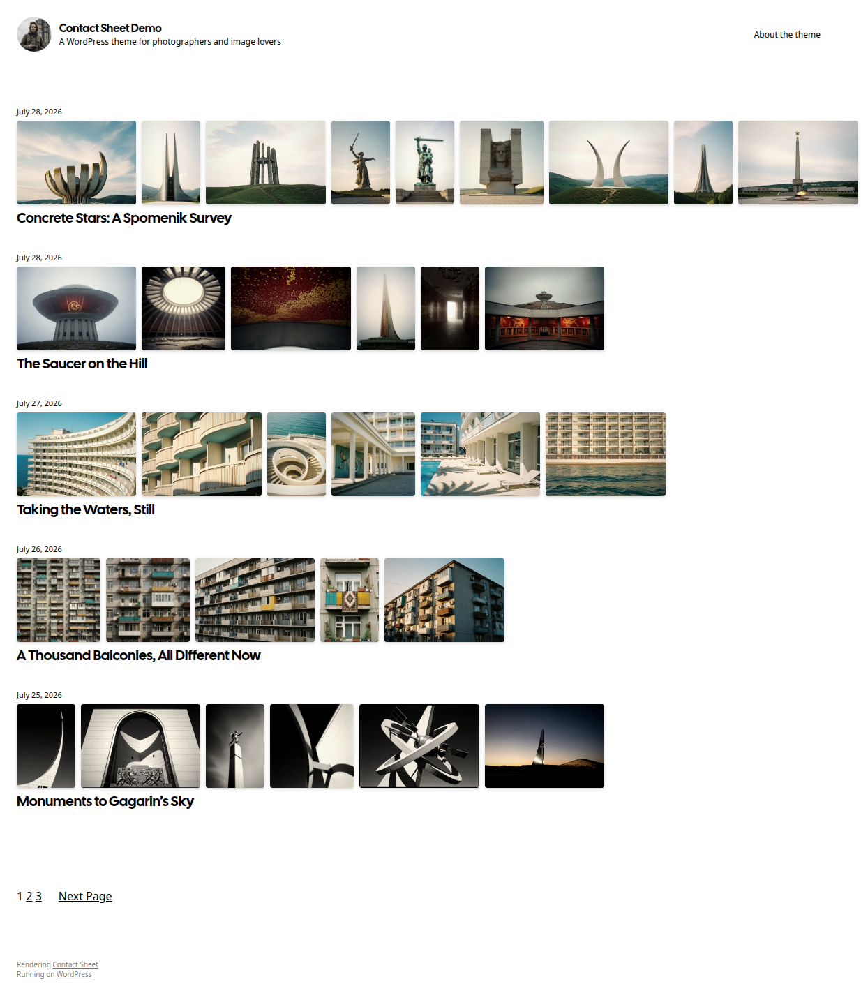
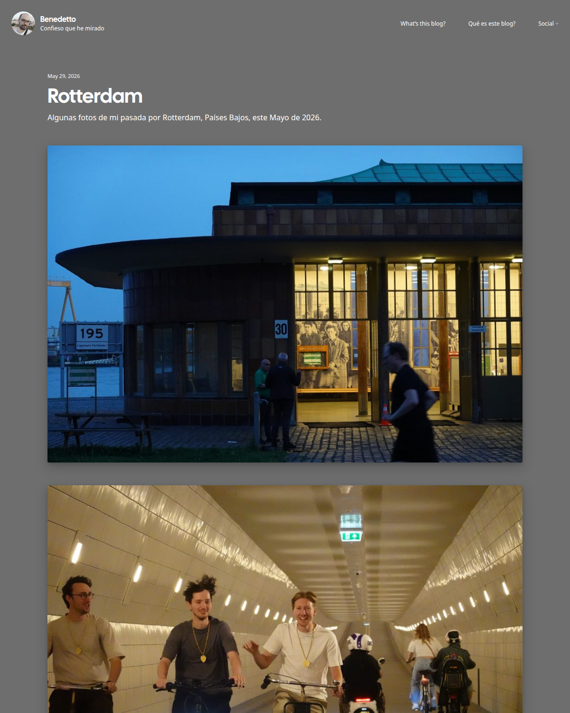
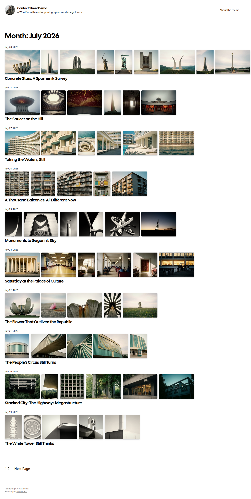
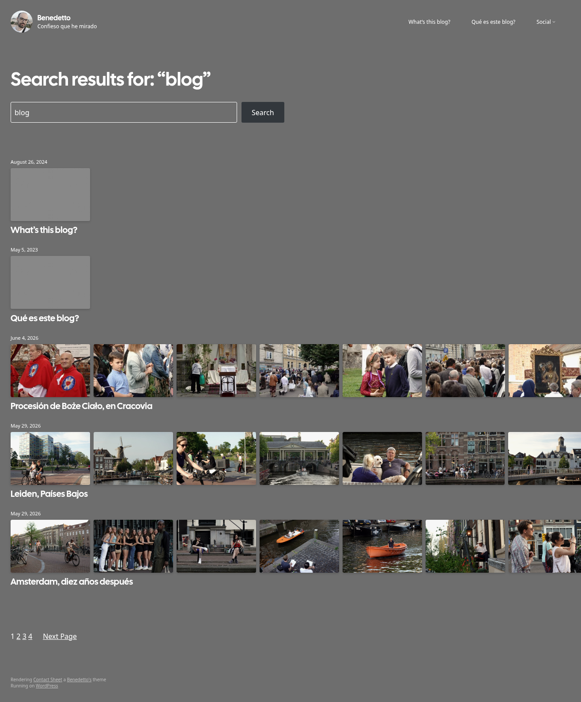
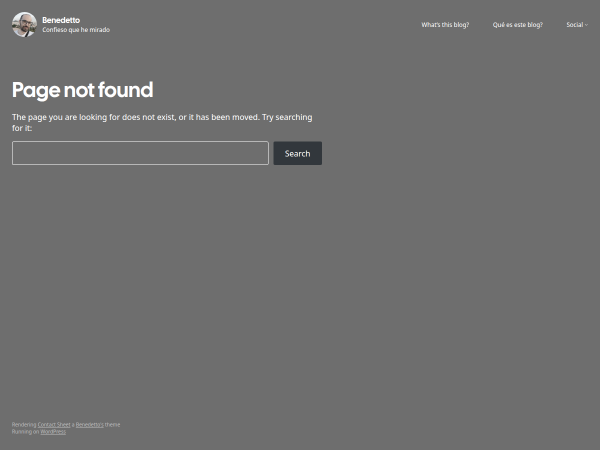
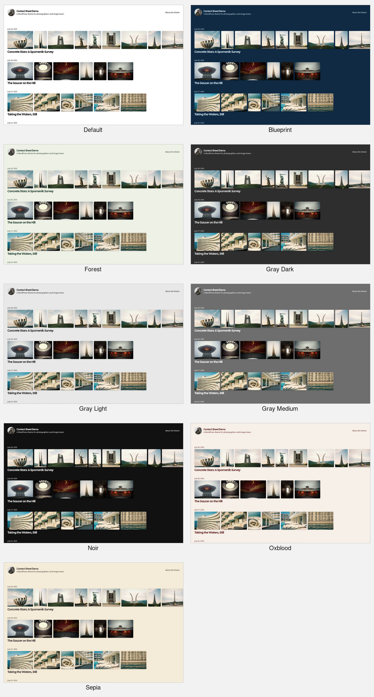
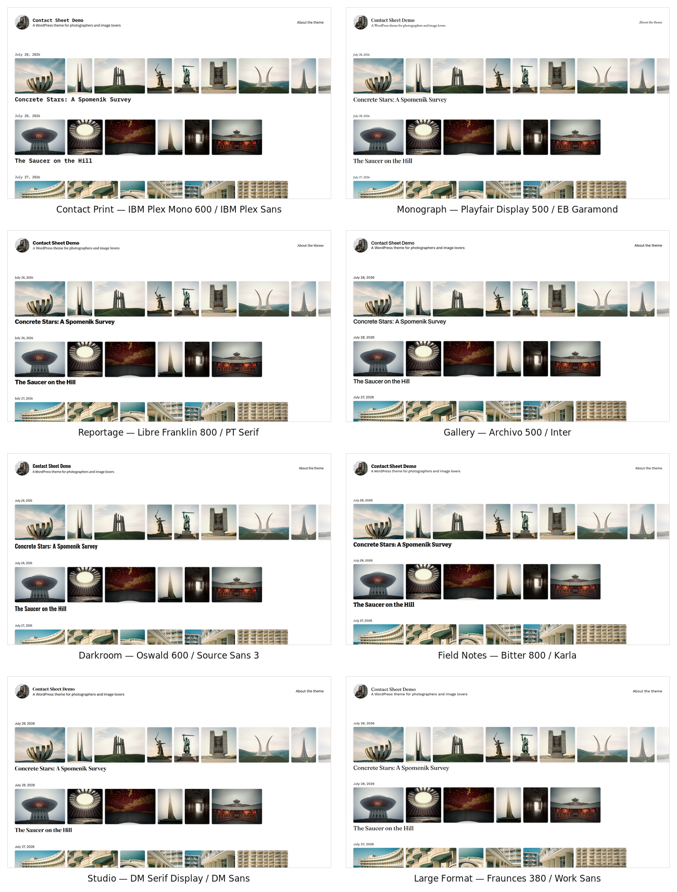

# Contact Sheet

A minimal photography blog theme for WordPress that presents each post's images
as a film-style **contact sheet**. On the home page, every post's photos render
in a horizontal scrolling strip — like a photographer's proof sheet — using the
bundled Photo Strip block. Single posts drop the strip and show the images full
width, with diffuse drop shadows so they read like printed photographs.

- Donwload it from WordPress theme directory: **[wordpress.org/themes/contact-sheet/](https://wordpress.org/themes/contact-sheet/)**
- Live demo: **[contactsheetdemo.mebenedetto.com](https://contactsheetdemo.mebenedetto.com/)**.
- Also running in the wild at **[mebenedetto.com](https://mebenedetto.com)**.



## Features

- **Photo Strip block** — renders a post's images as a horizontal, scrollable
  contact-sheet strip on listing pages, with a gray placeholder for image-less
  posts.
- **Photo-first single posts** — full-width images with printed-photo drop
  shadows, a clean comments section, and labelled previous/next post navigation.
- **Two-color palette** with style variations.
- **Full-site editing** — block templates for home, single, archive, search,
  page, and 404, all editable in the Site Editor.
- Cal Sans + system-ui typography, with eight bundled typography style
  variations (Google Fonts, self-hosted), translation-ready.

## Screenshots

### Single post

Full-width photos with printed-photo shadows.



### Archive

Date and term archives reuse the contact-sheet strips.



### Search



### 404



## Color variations

The theme ships a two-color (paper/ink) palette with eight style variations on
top of the default. Switch between them in **Appearance → Editor → Styles**.



## Typography variations

Eight typography style variations — the same number as the color variations —
each pair a heading face with a body face, bundled as woff2 files so no
third-party requests are made. Combine any of them with any color variation in
**Appearance → Editor → Styles**.

Heading weights and treatments are deliberately spread across the range — from
Fraunces Light to Libre Franklin ExtraBold — so each variation has its own
voice:

| Variation | Headings | Body |
|---|---|---|
| Contact Print | IBM Plex Mono 600, monospaced dates | IBM Plex Sans |
| Monograph | Playfair Display 500 | EB Garamond |
| Reportage | Libre Franklin 800, tight tracking | PT Serif |
| Gallery | Archivo 500 | Inter |
| Darkroom | Oswald 600 | Source Sans 3 |
| Field Notes | Bitter 800 | Karla |
| Studio | DM Serif Display 400 | DM Sans |
| Large Format | Fraunces 380 (light) | Work Sans |



## Requirements

- WordPress 6.8+
- PHP 7.2+

## Installation

1. In your admin panel, go to **Appearance → Themes** and click **Add New**.
2. Click **Upload Theme**, choose the theme's `.zip`, and click **Install Now**.
3. Click **Activate**.

To build a production zip from source: `npm install && npm run package` →
`contact-sheet.zip`.

## Demo content

Want your site to start out looking like the
[demo](https://contactsheetdemo.mebenedetto.com/)? The demo site's full content
— 15 photo-essay posts, the About page, and all of their images — ships as a
standard WordPress export file:
[`demo-site/contact-sheet-demo.xml`](demo-site/contact-sheet-demo.xml).

To import it into your site:

1. Install and activate the Contact Sheet theme.
2. Download
   [`contact-sheet-demo.xml`](https://raw.githubusercontent.com/matiasbenedetto/contact-sheet/trunk/demo-site/contact-sheet-demo.xml).
3. In your admin panel, go to **Tools → Import**, install the **WordPress**
   importer, and run it.
4. Upload the file, assign the posts to a user, and check **Download and import
   file attachments** so the photos are copied into your media library.

Or with WP-CLI:

```bash
wp plugin install wordpress-importer --activate
wp import contact-sheet-demo.xml --authors=create
```

The importer downloads the images from the live demo site, so the machine
running the import needs internet access.

## Development

The fastest way to develop the theme locally is the **Playground harness** in
[`playground/`](playground/README.md) — a disposable WordPress 7.0 site with the
Theme Check plugin and demo photo-blog content, no Apache/MySQL/Docker required:

```bash
bash playground/playground.sh bootstrap
bash playground/playground.sh seed
bash playground/playground.sh url      # open the live site
# after editing: bash playground/playground.sh sync && bash playground/playground.sh wp -- cache flush
```

The Photo Strip block source lives in `blocks/photo-strip/src/` and is built
into `blocks/photo-strip/build/`:

```bash
npm install
npm run build      # build the Photo Strip block
npm run package    # build + create contact-sheet.zip
```

Theme structure:

- `templates/*.html` — block templates (home, single, archive, search, 404, …)
- `parts/*.html` — template parts (header, footer)
- `theme.json` / `styles.css` — design tokens, palette, and custom CSS
- `blocks/photo-strip/` — the bundled Photo Strip block

See [`AGENTS.md`](AGENTS.md) for contributor guidance.

## License

GPLv2 or later. See [`readme.txt`](readme.txt) for the full changelog,
copyright, and bundled-resource credits (Cal Sans font, SIL OFL 1.1).
